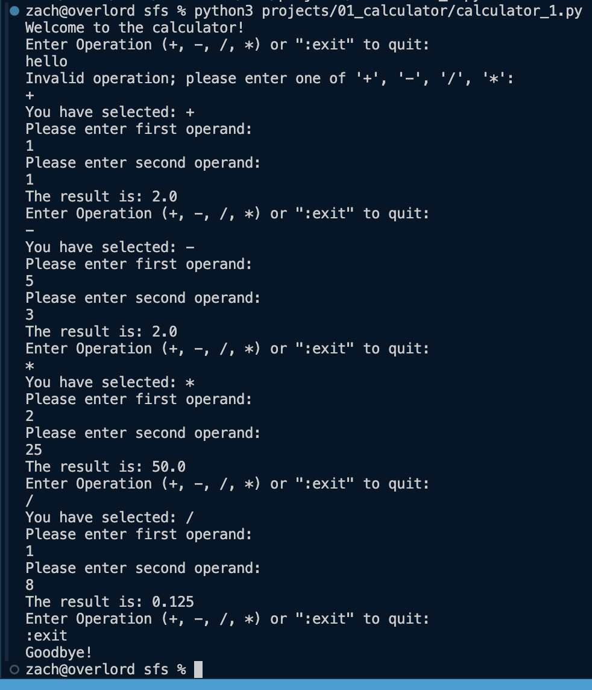

# Project 01 | Command Line Calculator 1.1
This project is intended to practice working with variables, loops, reading input, and understanding control flow.
## Spec
- A basic command-line calculator that supports five operations (`+`, `-`, `*`, `/`, `:exit`). 
- Program Flow:
    - User is prompted to enter an operation from the list (`+`, `-`, `*`, `/`, `:exit`).
    - User is prompted to enter a number, and then a second number, and then print the output of that operation on those numbers. 
    - Calculator return to initial state, and waits for the user to enter another operation. or `:exit` to quit the program. 
- Notes:
    - When the user enters an operation (or ":exit") the program should verify that the user has entered something valid and re-prompt them if they do not do so.
    - Checking if the user has entered a number or not generally needs a `try`-`except` block, which will be discussed later, and is not required for this project.

## Sample Output

## Submission
- Name your Python program `01-1_calculator_<lastname>_<first-initial>.py`; e.g. `01-1_calculator_campbell_z.py`
- Compress the file into a zip of the same name, either from the finder or the command line.
- Email it to `zacharyhcampbell@gmail.com`